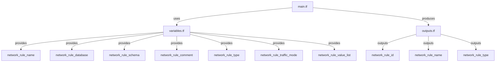
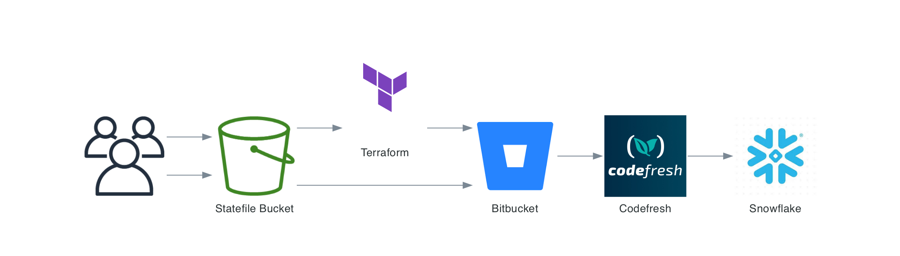

# Snowflake Network Rule Terraform Module: terraform-snowflake-network-rule

This Terraform module creates a Snowflake network rule to manage network access to a Snowflake database. The network rule is configured with parameters for the database, schema, traffic mode, and list of allowed or denied values (e.g., IP addresses).


[](https://github.com/Richard-Barrett/terraform-snowflake-network-rule/actions/workflows/iac-codeql.yaml)
[](https://github.com/Richard-Barrett/terraform-snowflake-network-rule/actions/workflows/terraform_validate.yaml)
[](https://github.com/Richard-Barrett/terraform-snowflake-network-rule/actions/workflows/tflint.yaml)
[](https://github.com/Richard-Barrett/terraform-snowflake-network-rule/actions/workflows/trivy.yaml)

<details>
<summary>Module Diagram</summary>



</details>

## CICD Implementations

An Example of a CICD Integration using Codefresh and BitBucket with this module can be found below:



## Requirements

- **Terraform**: Version >= 1.3.6
- **Snowflake Provider**: Version >= 1.0.0

## Usage

```hcl
module "snowflake_network_rule" {
  source = "git::https://github.com/Richard-Barrett/terraform-snowflake-network-rule.git?ref=0.2.0"


  network_rule_name         = "example_rule"
  network_rule_database     = "EXAMPLE_DB"
  network_rule_schema       = "EXAMPLE_SCHEMA"
  network_rule_type         = "TYPE_OF_RULE"  # Replace with your specific rule type
  network_rule_traffic_mode = "ALLOW"         # or "DENY"
  network_rule_value_list   = ["192.168.1.1", "192.168.2.0/24"]
}
```

## Inputs

| Name                    | Description                                                                      | Type           | Default | Required |
|-------------------------|----------------------------------------------------------------------------------|----------------|---------|----------|
| `network_rule_comment`  | A comment to add to the network rule. Defaults to a generated comment if `null`. | `string`       | `null`  | No       |
| `network_rule_database` | The database where the network rule will be applied.                             | `string`       | n/a     | Yes      |
| `network_rule_name`     | The name of the network rule to be created.                                      | `string`       | n/a     | Yes      |
| `network_rule_schema`   | The schema within the database where the network rule will be applied.           | `string`       | n/a     | Yes      |
| `network_rule_traffic_mode` | The mode of traffic for the network rule (e.g., `ALLOW`, `DENY`).           | `string`       | n/a     | Yes      |
| `network_rule_type`     | The type of network rule.                                                        | `string`       | n/a     | Yes      |
| `network_rule_value_list` | A list of values (e.g., IP addresses) for the network rule.                    | `list(string)` | n/a     | Yes      |

## Outputs

| Name                     | Description                                                       |
|--------------------------|-------------------------------------------------------------------|
| `network_rule_id`        | The ID of the created network rule.                               |
| `network_rule_name`      | The name of the created network rule.                             |
| `network_rule_database`  | The database associated with the network rule.                    |
| `network_rule_schema`    | The schema associated with the network rule.                      |
| `network_rule_comment`   | The comment added to the network rule.                            |
| `network_rule_value_list`| The list of values associated with the network rule.              |


<!-- BEGIN_TF_DOCS -->
## Requirements

| Name | Version |
|------|---------|
| <a name="requirement_terraform"></a> [terraform](#requirement\_terraform) | >= 1.5.7 |
| <a name="requirement_snowflake"></a> [snowflake](#requirement\_snowflake) | ~> 0.97.0 |

## Providers

| Name | Version |
|------|---------|
| <a name="provider_snowflake"></a> [snowflake](#provider\_snowflake) | ~> 0.97.0 |

## Modules

No modules.

## Resources

| Name | Type |
|------|------|
| [snowflake_network_rule.this](https://registry.terraform.io/providers/Snowflake-Labs/snowflake/latest/docs/resources/network_rule) | resource |

## Inputs

| Name | Description | Type | Default | Required |
|------|-------------|------|---------|:--------:|
| <a name="input_network_rule_comment"></a> [network\_rule\_comment](#input\_network\_rule\_comment) | A comment to add to the network rule. Defaults to a generated comment if not provided. | `string` | `null` | no |
| <a name="input_network_rule_database"></a> [network\_rule\_database](#input\_network\_rule\_database) | The database where the network rule will be applied. | `string` | n/a | yes |
| <a name="input_network_rule_name"></a> [network\_rule\_name](#input\_network\_rule\_name) | The name of the network rule to be created. | `string` | n/a | yes |
| <a name="input_network_rule_schema"></a> [network\_rule\_schema](#input\_network\_rule\_schema) | The schema within the database where the network rule will be applied. | `string` | n/a | yes |
| <a name="input_network_rule_traffic_mode"></a> [network\_rule\_traffic\_mode](#input\_network\_rule\_traffic\_mode) | The mode of traffic for the network rule (e.g., ALLOW, DENY). | `string` | n/a | yes |
| <a name="input_network_rule_type"></a> [network\_rule\_type](#input\_network\_rule\_type) | The type of network rule. | `string` | n/a | yes |
| <a name="input_network_rule_value_list"></a> [network\_rule\_value\_list](#input\_network\_rule\_value\_list) | A list of values (e.g., IP addresses) for the network rule. | `list(string)` | n/a | yes |

## Outputs

| Name | Description |
|------|-------------|
| <a name="output_network_rule_id"></a> [network\_rule\_id](#output\_network\_rule\_id) | The ID of the network rule. |
| <a name="output_network_rule_name"></a> [network\_rule\_name](#output\_network\_rule\_name) | The name of the network rule. |
| <a name="output_network_rule_type"></a> [network\_rule\_type](#output\_network\_rule\_type) | The type of the network rule. |
<!-- END_TF_DOCS -->

## Licence

MIT License. See [LICENSE](https://github.com/Richard-Barrett/terraform-snowflake-network-policies/blob/main/LICENSE) for full details.
